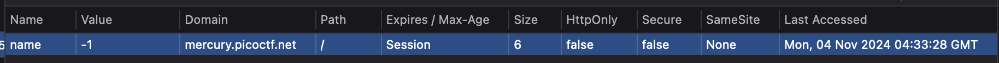

# Cookies

## Challenge

Who doesn't love cookies? Try to figure out the best one.

## Solving

We are greeted with a website with an entry box that allows us to enter text. I enter some random words, and am told that it is not a valid cookie. Since the name of the challenge is **"cookies"**, we obviously have to work with the website cookies. I open the cookies of the site and take a look.



Nothing seemed too obvious out of the blue. I went back to the entry box and entered some random things, And then I decided to try to enter "chocolate chip". It did not yield an error this time, and it was indeed a valid cookie name.

i then have to see how the website validates the cookie names. i open up burp suite and try look at the incoming packets.

This was the incoming packet for an invalid cookie:

```
GET /check HTTP/1.1
Host: mercury.picoctf.net:21485
Cache-Control: max-age=0
Accept-Language: en-GB,en;q=0.9
Upgrade-Insecure-Requests: 1
User-Agent: Mozilla/5.0 (Windows NT 10.0; Win64; x64) AppleWebKit/537.36 (KHTML, like Gecko) Chrome/129.0.6668.71 Safari/537.36
Accept: text/html,application/xhtml+xml,application/xml;q=0.9,image/avif,image/webp,image/apng,*/*;q=0.8,application/signed-exchange;v=b3;q=0.7
Referer: http://mercury.picoctf.net:21485/
Accept-Encoding: gzip, deflate, br
Cookie: name=-1
Connection: keep-alive

```

And this was the incoming packet for a valid cookie (snickerdoodle):

```
GET /check HTTP/1.1
Host: mercury.picoctf.net:21485
Cache-Control: max-age=0
Accept-Language: en-GB,en;q=0.9
Upgrade-Insecure-Requests: 1
User-Agent: Mozilla/5.0 (Windows NT 10.0; Win64; x64) AppleWebKit/537.36 (KHTML, like Gecko) Chrome/129.0.6668.71 Safari/537.36
Accept: text/html,application/xhtml+xml,application/xml;q=0.9,image/avif,image/webp,image/apng,*/*;q=0.8,application/signed-exchange;v=b3;q=0.7
Referer: http://mercury.picoctf.net:21485/
Accept-Encoding: gzip, deflate, br
Cookie: name=0
Connection: keep-alive
```

the name parameter changes. i notice this and manually change it to 1 to see what happens. it returns the chocolate chip page. i change it to 2 and it returns another cookie name. I do a simple binary search and find out there are 28 cookies in total.

I thought of making a scraper to look for pages where the line "That is a cookie! Not very special though..." was not there, but i was too lazy and decided to search through all 28 manually. i eventually find the flag in cookie number 18.

# Flag

**picoCTF{3v3ry1_l0v3s_c00k135_94190c8a}**